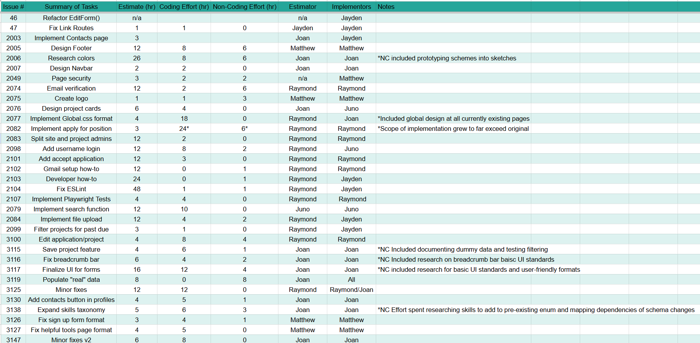

  <h3>
    Effort Estimation & Tracking in Project: TeamUHp!
  </h3>

 

  

 

The most daunting part of a climb is seeing how much area is left to cover, and height above to traverse. Once you begin the journey, however, the perception of these things change. You realize that it may not be as difficult as you thought initially; that if you were to just keep at this pace consistently you can make it to the top in a few calculations. Inversely, you may realize your pace is faster than you thought, and can complete it quicker than you left time to do so. On another hand, you may find that the easy path for regular hikers has closed, and must figure another method or more difficult path to take, and the estimate is suddenly out of your hands. It may be that you wanted the simple scenic path, but suddenly an arduous expert’s climb has creeped into your scope? I experienced this journey during the development of [TeamUHp](https://team-uhp.github.io/), in the efforts to estimate effort. 

## A Gauge At Myself

I made my estimations based on the tasks that were similar to the WoDs we had done, and my pattern of time completions during those WoDs. For example, if the task required data modeling and database schema design, I would have recalled the performance I had with those WoDs, in addition to my familiarity with the implementation and design structures. If the task required more styling or css implementations, I would have to anticipate the time it takes to simply make aesthetic decisions, let alone implement them in a consistent and neat way. Secondly, if it concerned those areas in particular, I would take some time to address the mapping of dependencies that require different files and functions to be altered specific to this new change. 

##  The Power of a Good Guess

Estimating in advance allowed me to consider the scope of the objectives intended for that issue, allowing a distribution of anticipated efforts for members on the team. For example, when an issue is estimated then implemented by a different member of the team, the estimated time can be discussed and allow for both the person who created it and the person intended to implement it to have a discussion on the objectives intended for that specific concern. 

Additionally, seeing which tasks are in progress for each member of the team aided to advise who can pick up the next available tasks, and allow for quantifying an even distribution of work, as needed.

I would also add that seeing the actual time effort go either below or above the expected time, allows me to tune the expectation for the workflow moving forward. I did find in my estimations that the times I expected for a task became more accurate after [each milestone](https://team-uhp.github.io/#development-history), whether it be my experience in the project’s development becoming more consistent and refined, or the lessons have been learned from under and overestimating past tasks. 

## Beyond Single Paths

Over the course of this project, my idea and practical understanding of project management was greatly enlightened. I experienced turning high level ideas into minute scopes of objectives, sketches of mockup pages into functional replicable schemes, and an overall objective to aid a community into a real and accessible application. This truly does not come without additive planning. It is now that I know, this planning portion to consider the hard efforts is justifiable to the efforts themselves, as the efforts in a connected whole will allow ease of a team’s coordination, ease on individual members’ workload, and a coherent composition of the team’s goals as a whole. 

## Tracking Methods

Initially, I had utilized the “started” and “ended” timestampable fields in GitHub’s project area, but then realized that it does not necessarily account for the in betweens of times not related to the project. Thus I had a personal, informal log off to track when I am online and offline for this project to composite the sum of those online hours. When an actual timer was not used, or I had missed a portion in my personal log, I estimated it by memory when the issue was completed, or at the earliest recollection.

After having experienced estimation and effort tracking, I would greatly enhance this process in my next project. Next time, I intend to formally track my hours of work on an issue in a spreadsheet with functionals and conditional formatting for emphasis and ease of use, or utilize one of the many available productivity and project management tools such as Notion, Asana, or Canva’s project management feature. Or perhaps, I could develop such an application to aid this myself!