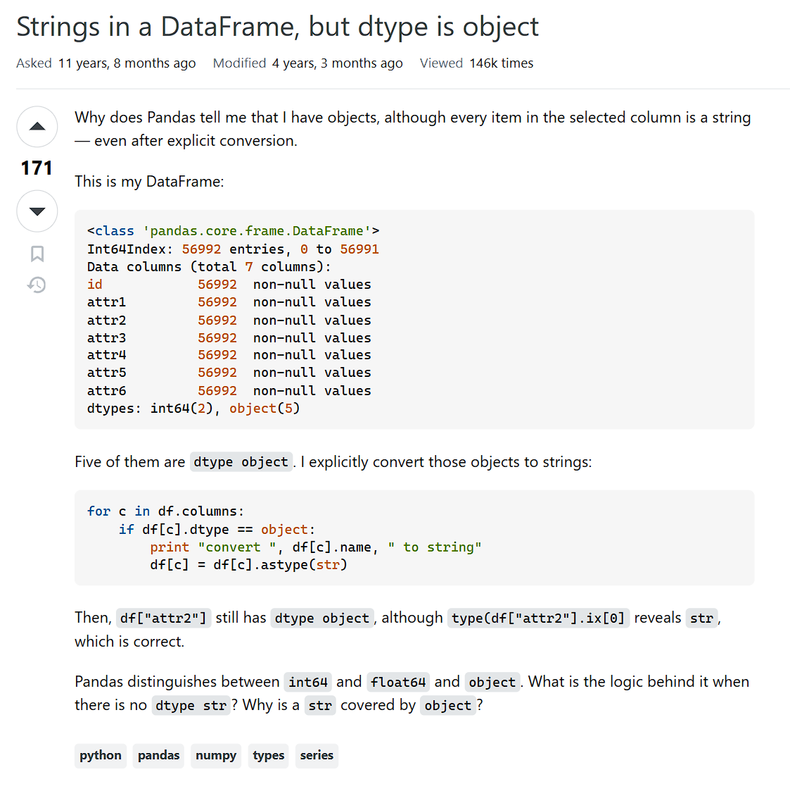

## Smart Questions Are A Conduit For Learning 

They say you can become the kind of person you want to be by surrounding yourself with the right people. People who are the kind of person you want to become or represent yourself as. 
As such, in this field of near infinite sharing of information, this has become a conduit for prompt, discussion, and overall fantastic learning opportunities. 

Practice makes perfect, but there’s also such a saying that perfect practice makes perfect. 
To learn, we must ask questions. But to most effectively learn, the matter of your question and the intent to learn from it is what distinguishes smart questions from poor ones. 

## Boarding Your Train of Thought
In light of the time I studied machine learning while abroad, I took to the machine learning forums on Stack Overflow as a plus to be more engaged with the topics in this community. 

In this question on [datatypes in dataframes](https://stackoverflow.com/questions/21018654/strings-in-a-dataframe-but-dtype-is-object/60748009#60748009), the poster provides their code and presents it along with the commentary on the context for which they expect the datatype to be. They clearly and concisely describe what their expectation was for their code, what theory that expectation is founded on, and what actions they are adding to their code that help to inform the explicit expectation. 

This is evident when poster expects to have a string datatype, explicitly converts the datatype, yet the conversion for some items are Objects rather than strings, then provides context about the pandas library and why their expectation is met with confusion. Addressing each portion like this allows commenters to understand where your current train of thought is, and they may even tailor some of their teachings to guide you in the right direction.

I find it enlightening to see the types of conversations and methods of teaching others will share when smart questions like this are asked. Looking at the answers provided, user @HYRY provided an illustrative example to map out the concept behind the poster’s inquiry. 

And in the next answer, the commenter @Ben further explains the concept @HYRY brought up, as if scaffolding off of the discussion of another. This user also provides highly detailed and annotated images and even animated graphics to build up on the other commenter’s illustration, and transform the collaborative explanation into a demonstration. Such efforts also lead me to be encouraged by the willingness for those more wise than I to share their knowledge and the kindness of their efforts, as well as the effects a smart question can do for any other passerby viewer. 

## Help Others Help You!

The previous was an example of a smart question and how such a post can grow into a greater learning opportunity. In this question on [“how to find missing info,”](https://stackoverflow.com/questions/60262828/machine-learning-how-to-find-missing-info) the poster asks for help with an issue in their code. The poster does provide their code in text, yet we lack the context about the code besides the title of the post and the names of the variables. This prompts a potential commenter to have to ambiguously analyze these algorithms and try to assume where the poster’s train of thought is based on. Unfortunately, the “problem” is never quite defined, but the poster asks to have “someone tell me what is causing this problem.” Unlike the previous question, where we can interpret that the poster has some interpretation based on their understanding of the pandas library and may have done some research in advance to inform the smart question, this user does not see that an answer for a similar inquiry has already been posted somewhere, as indicated by annotation “This question already has answers here.” 

## A Smart Question is Active Learning In Progress
Nobody likes to be confused, and yet the time we spend being confused can be the most profound in engaging our ability to think and learn. When we can ask a smart question, we allow ourselves to map out our confusion and allow others to address areas that can be answered. Unknowingly, we can help others who may have the same inquiry at the same time, and we can become better teachers to others who find themselves in the same position you once had questions for. 
