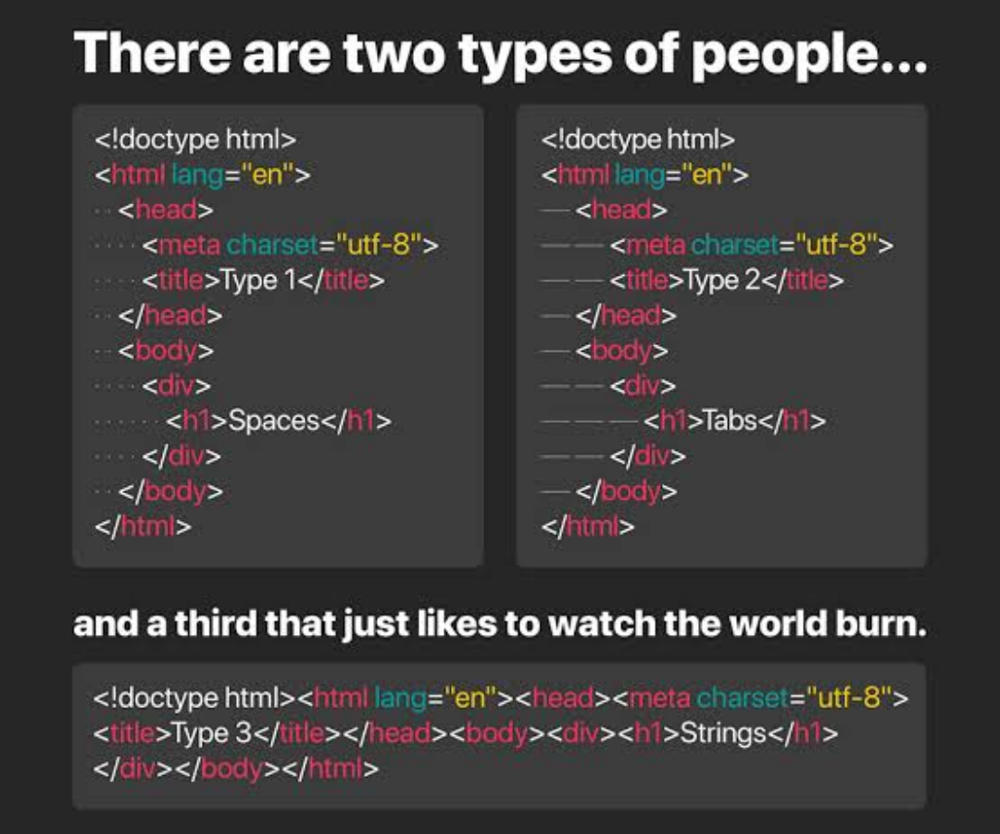

## Bigger Than the Coder

I think making code clear is beneficial for a team, multiple team collaborations, and even for successors of a team who will work on, debug, improve, and build off of the code of their predecessors. Thus, the ability to have readable code on top of effective and logically consistent code helps more than just the initial engineer. 

In the sense of open source tools as well, this is also what strangers build off of another stranger's work, which may end up giving power to those with strong ideas to grow it into something bigger. Having coding standards helps to constantly develop that, even if the engineers aren't all on the same page or even in communication with one another.

## Correction into Intuition

This further scaffolds on the idea that practice builds intuition. By utilizing such correctors like ESLint, we can receive immediate feedback that eventually builds into an expected response, then active correction, then ultimately a habit of good practice without prompting such errors anymore, as we'd then have the experience of encountering them many times. 

Personally, I find that the more I correct myself, the more I feel like I am building a professional standard, and a habit which will be of use to a team I may work with or a project that I will do for myself.

At first I had thought it tedious that I couldn't conveniently just press tab to indent, but had to count my number of spaces. But when I see the product of my code in a neat fashion, I tend to be proud of it. One reference I always make for that finished product is when I would react to code that my professor would provide in ICS211 or ICS212 for example. I always found that even if I was reading the code in a basic Notepad text editor or in a black and white console, it was still very easy to trace the code and the formatting was always consistent. 
Through use of ESLint, I realized I was gradually doing the practices to get the very same standard, and checking off something I had always wanted to adopt as well. 

## Practice of Useful Tools

I also enjoyed that I was learning ways to install and utilize useful extensions to accommodate my programming experience. While I had initially viewed that extensions in VScode could be a preference thing, or a simple integration with other tools, I see that it can also be used to correct my personal habits as a student developer still trying to figure the best practices for this tech world. 
