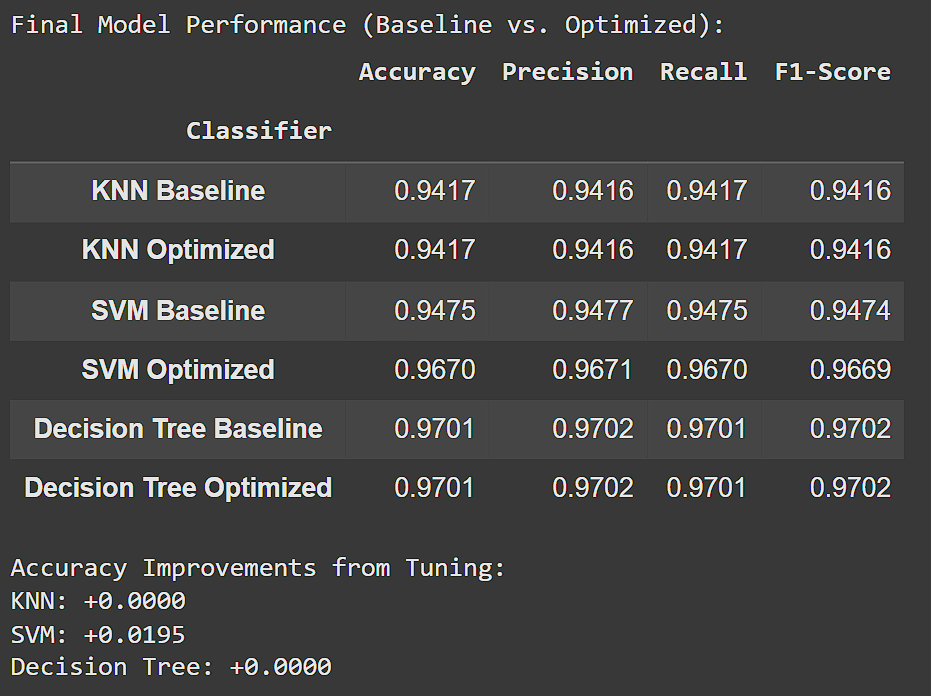
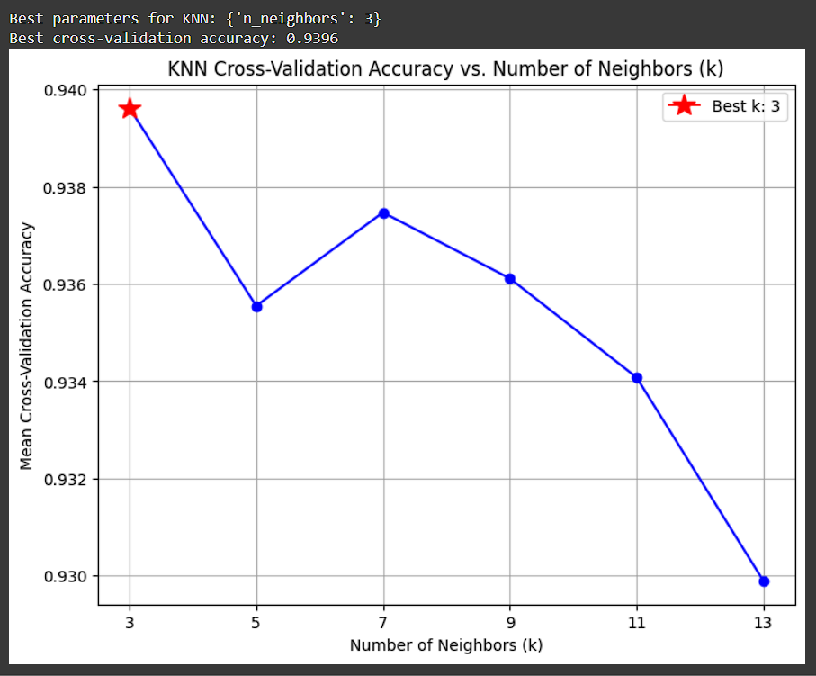
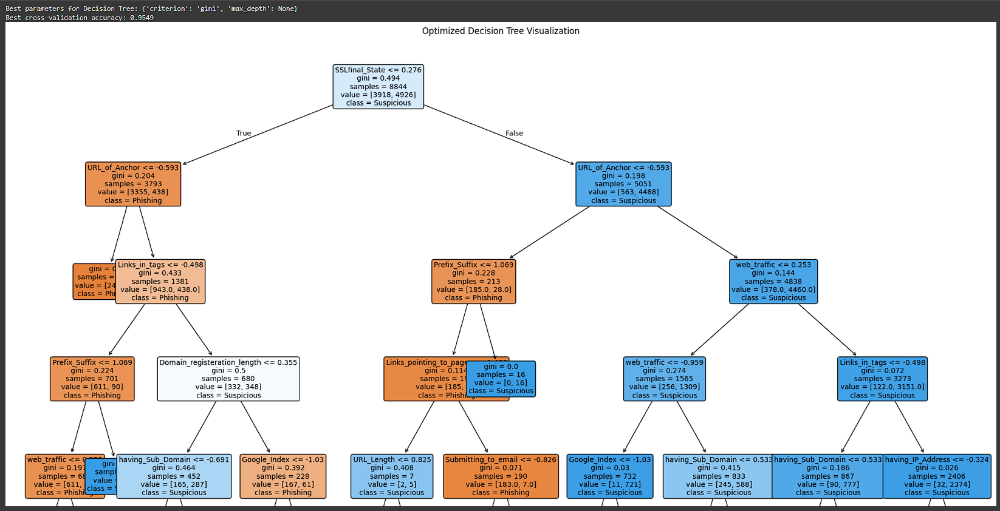

## Strapping My Boots to Venture the World of Design

During this past week of ICS314 on HTML and UI design with Bootstrap 5, these modules have given me some of the best feelings about the skills I am gaining so far. 
Perhaps it is that the things that I am able to produce in code are becoming more and more visual in substance, and are growing in their interactiveness. As a computer science student whose courses have so far have had an emphasis on theory, the things that I have learned to create with UI design have given me far more confidence in the capacity there is to learn something new, more context towards this position of design for a developer. Additionally, despite all the happenings and integrated technologies of this modern age, I feel these newfound understandings have made something I encounter every moment of the day–websites–a lot less of a mystery. 

My first encounter with really looking over HTML was through experience in a SOC. While investigating potentially malicious sites, the F12 button never hurt to try and see if I could obtain information in the devtools panes. However, in truth, a lot of it seemed like obscure structures of text in such a raw form of code, that I didn’t quite get the value out of tracing the words. 

  
  
  

