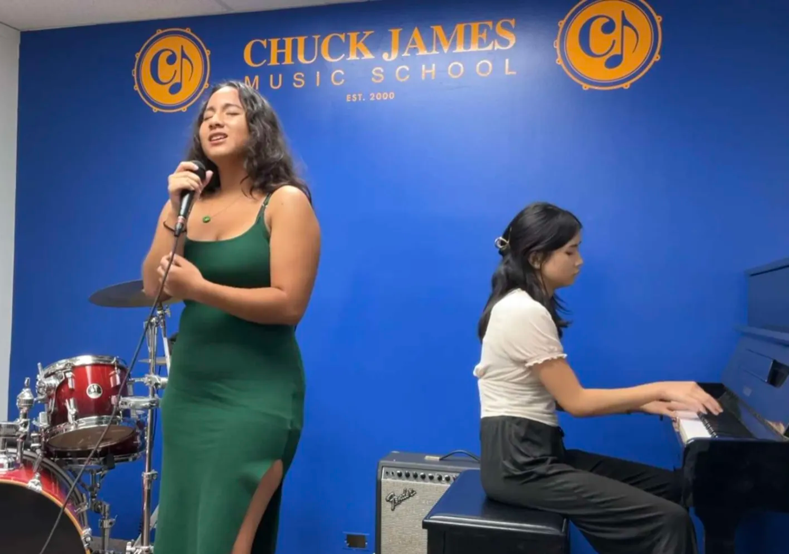

---
layout: project
type: project
image: img/piano-thumbnail.jpg
title: "Piano Composition for Student Performance"
date: 2024
published: true
labels:
  - Music
  - Piano
  - Performance
  - Teaching
summary: "Composed original music for piano students to preform, allowing their imagination for their desired sound to become a real piece, and accompanied vocal students and student bands at live music events."
--- 

  

Over the years, students have shared the stage at events like Hawaii Oktoberfest, Hawaiian Brian's, Blue Note Waikiki, 50th-State Fair, Honolulu Food Fest, and more! Students have prepared their original pieces for live performance and rehearsed with other students when colaborating.

One of my favorite parts of teaching is helping students compose their own pieces. Whether it’s a solo piano work, a piano accompaniment, or a full band piece. I also encourage students to connect and collaborate with others in the music school. Rehearsals and performances often bring together piano, voice, guitar, and drum players, letting students experiment with playing as a band and creating their sound together. 

As a teacher in music, I find it so wonderful to be able to pass what I have learned to my students, and to have used all the experience and time I put into music and tailoring learning experiences to a students needs and desires. There is joy in being able to pass what I have learned in such opportunities to those who seek to discover the same, or even multiply the rewards of their learning by sharing what I have to give. 